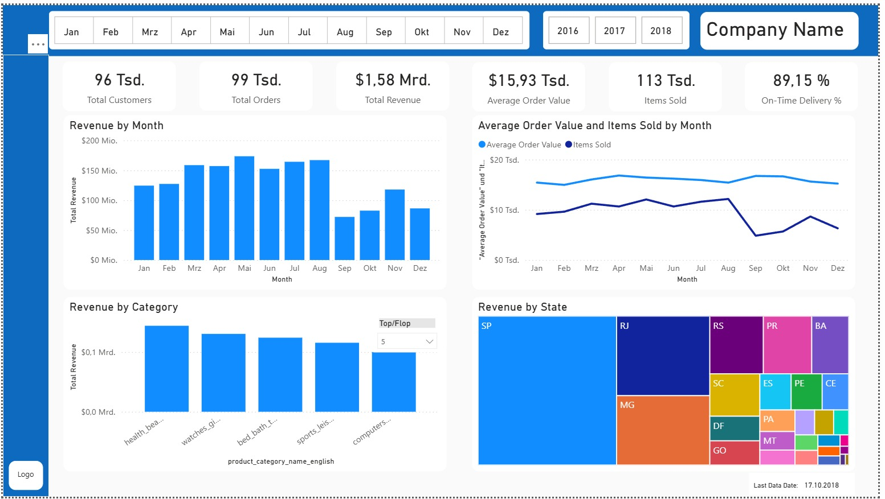
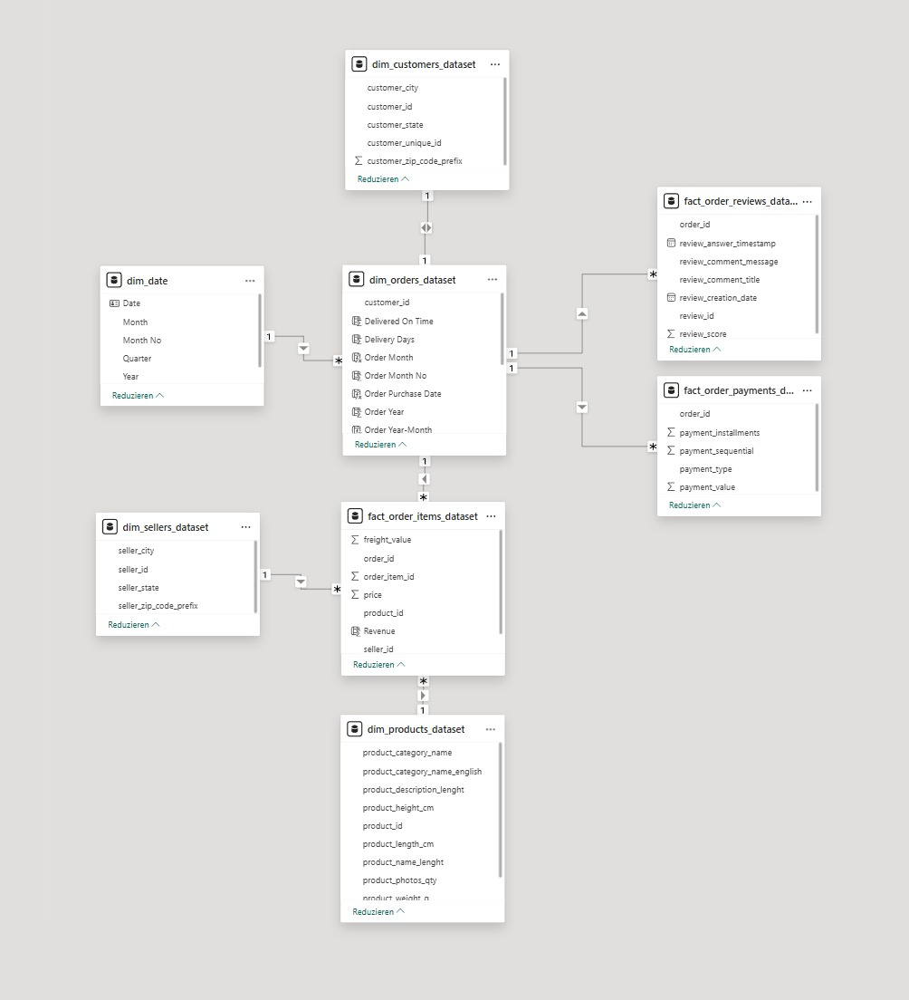

**Work in Progress**

# Power BI E-Commerce Analytics Dashboard

This project is an interactive **Power BI dashboard** built using the **Brazilian E-Commerce Public Dataset by Olist**.

The goal of this project is to demonstrate skills in:

- Data modeling
- DAX measures
- Business KPI design
- Data visualization
- Dashboard storytelling

---

# Dashboard Preview

*(Screenshot will be added once the dashboard is finalized)*

---

# Download Dashboard

You can download the Power BI dashboard here:

[Download PBIX File](https://drive.google.com/file/d/1lEo9NwjclUkJgaNGT3LU4JovEKXcvLmK/view?usp=sharing)

---

# Dataset

Brazilian E-Commerce Public Dataset by Olist  
Source: Kaggle  

https://www.kaggle.com/datasets/olistbr/brazilian-ecommerce

The dataset contains information about:

- Orders
- Customers
- Products
- Payments
- Reviews
- Sellers
- Geolocation

---

# Data Model

The dashboard uses a **star schema data model**.

Fact tables:

- fact_order_items_dataset
- fact_order_payments_dataset
- fact_order_reviews_dataset

Dimension tables:

- dim_orders_dataset
- dim_customers_dataset
- dim_products_dataset
- dim_sellers_dataset
- dim_date
- dim_geolocation_dataset

This structure allows efficient filtering and aggregation across the model.

---

# Key Metrics

The dashboard includes the following business KPIs:

- Total Revenue
- Total Orders
- Total Customers
- Average Order Value
- Items Sold
- On-Time Delivery %

---

# Dashboard Features

## Revenue Performance

- Revenue by Month
- Revenue trends over time

## Product Performance

- Revenue by Product Category
- Top / Flop category filtering

## Customer Insights

- Revenue by Customer State
- Geographic distribution of sales

---

# Tools Used

- Power BI
- DAX
- Power Query
- Star Schema Data Modeling
